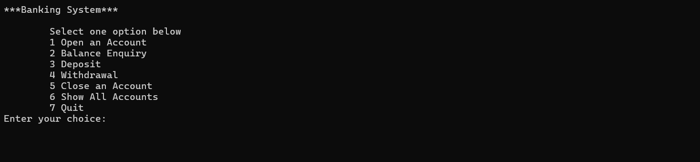
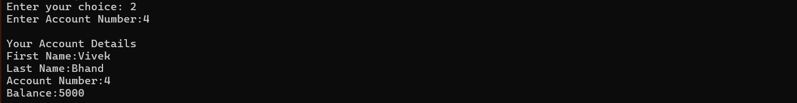

# 🏦 Banking-Project

Welcome to the **Banking-Project** — your simple, efficient, and reliable banking solution designed to help banks seamlessly manage customer accounts with ease and security.

---

## 💼 Features

- **Account Management:**  
  Create, update, and maintain multiple customer accounts effortlessly.

- **Transactions:**  
  Perform secure **Deposits** and **Withdrawals** with instant updates to account balances.

- **Banking Functions:**  
  Implemented a wide range of banking-related functions to simulate real-world banking operations smoothly.

---

## 🛠️ Functionalities

| Operation            | Description                                       |
|---------------------|-------------------------------------------------|
| **Create Account**   | Initialize new customer accounts with unique IDs. |
| **Manage Account**   | Edit customer details and account preferences.  |
| **Deposit Money**    | Add funds to customer accounts securely.        |
| **Withdraw Money**   | Withdraw funds with balance checks and limits.  |
| **View Account Info**| Display account details and transaction history.|

---

## 💡 Additional Details

This application provides banking solutions tailored for banks to efficiently manage customer accounts. You can **create and manage accounts** with full control over each user profile. The system supports core banking operations such as **depositing** and **withdrawing** money from accounts, along with many other banking functions implemented to mimic real-life banking scenarios.

---

## 📚 Technologies Used

- Programming Language: **C++** (or your language of choice)  
- Concepts: **Object-Oriented Programming, Data Structures**  
- Core Modules: Account Management, Transaction Processing  

---
## 📸 Screenshots

### 1. Account Management Panel 

---

### 2. Creating New Account

---

### 3.Balance Enquiry

---

### 4.  Depositing Money into an Account 

---

### 5. Withdrawing Money Securely  

